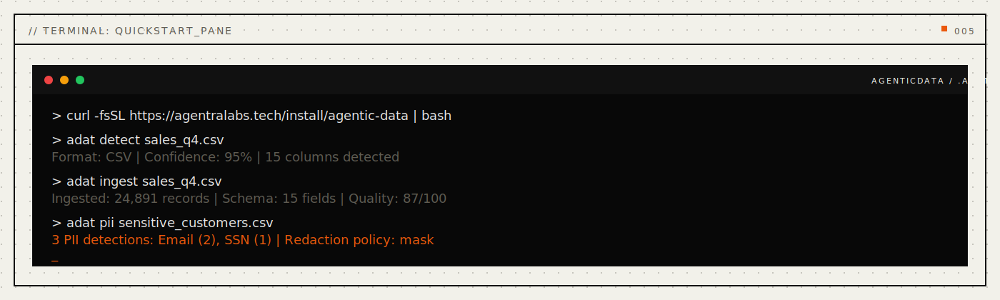

<p align="center">
  
</p>

<p align="center">
  
  
  
  
</p>

<p align="center">
  <a href="#install"></a>
  <a href="#mcp-server"></a>
  <a href="LICENSE"></a>
  <a href="paper/paper-i-data-comprehension/agenticdata-paper.pdf"></a>
  <a href="docs/public/file-format.md"></a>
</p>

<p align="center">
  <strong>Universal data comprehension for AI agents.</strong>
</p>

<p align="center">
  <em>Every format parsed. Every schema inferred. Every lineage tracked. Every anomaly caught.</em>
</p>

<p align="center">
  <a href="#problems-solved">Problems Solved</a> · <a href="#quickstart">Quickstart</a> · <a href="#how-it-works">How It Works</a> · <a href="#24-capabilities">24 Capabilities</a> · <a href="#mcp-server">MCP Tools</a> · <a href="#benchmarks">Benchmarks</a> · <a href="#the-engine">Engine</a> · <a href="#install">Install</a> · <a href="docs/public/api-reference.md">API</a> · <a href="paper/paper-i-data-comprehension/agenticdata-paper.pdf">Paper</a>
</p>

---

## Every data tool solves one format.

pandas reads CSV but doesn't understand what the columns *mean*. SQL tools query databases but can't infer missing schemas. PDF parsers extract text but lose table structure. ETL tools transform data but don't track where it came from. **Every tool is a silo.**

The current fixes don't work. Writing custom parsers for every format doesn't scale. Building ETL pipelines takes months. Data dictionaries go stale the day they're written. PII detection with regex misses context-dependent cases. And when something goes wrong, nobody can trace the data back to its source.

**AgenticData** is one engine that does ALL of it with understanding. Not just parsing -- *comprehension*. Give it any file in any format and it infers the schema, detects types (email, date, currency, IP address), tracks every transformation with field-level lineage, monitors quality with continuous anomaly detection, and redacts PII context-aware. One engine. 16 formats. 24 capabilities. 122 MCP tools.

<a name="problems-solved"></a>

## Problems Solved (Read This First)

- **Problem:** every tool handles one format, and you need a different parser for CSV vs JSON vs SQL vs PDF vs XML.
  **Solved:** 16 format parsers with auto-detection at 90-95% confidence. Give it ANY file, it identifies and parses it.
- **Problem:** "what does column flag7 mean?" -- nobody knows, the original developer left.
  **Solved:** Data Soul Extraction analyzes data itself to infer meaning, relationships, and business rules automatically.
- **Problem:** ETL transforms data but you can't trace where a value came from.
  **Solved:** every record carries full lineage (Data DNA) -- source, transforms, trust score. Field-level provenance.
- **Problem:** bad data silently corrupts downstream reports and ML models for weeks before anyone notices.
  **Solved:** Data Immune System scores quality 0-100 across 5 dimensions, detects anomalies (null spikes, statistical outliers), quarantines bad records.
- **Problem:** GDPR requires redacting PII but regex misses "Dr. Smith's patient on Oak Street."
  **Solved:** context-aware PII detection (email, phone, SSN, credit card via Luhn, IP) with configurable redaction policies (mask, hash, placeholder, remove).
- **Problem:** querying across 3 databases requires building a data warehouse -- 6 months and $200K.
  **Solved:** federated query across any registered source. Data stays in place. Results arrive in milliseconds.

```bash
# Your agent comprehends data
adat detect sales_q4.csv           # Format: CSV, 95% confidence, 15 columns
adat ingest sales_q4.csv           # 24,891 records, schema inferred, quality: 87/100
adat quality sales_q4              # Completeness: 97%, Uniqueness: 99%, Freshness: 100%
adat pii sensitive_customers.csv   # 3 PII: Email (2), SSN (1) → redact with /mask
```

One command. Schema inferred. Quality scored. Lineage tracked. Works with Claude, Cursor, Windsurf, or any MCP client.

<p align="center">
  
</p>

---

<a name="24-capabilities"></a>

## 24 Capabilities

AgenticData organizes 122 MCP tools into 24 capability groups across 8 categories. Each group solves a specific data comprehension challenge.

### Comprehension Capabilities (Understanding what data IS)

| # | Capability | Tools | What it does |
|:--|:----------|------:|:-------------|
| 1 | **Schema Telepathy** | 5 | Infer schema from raw data, align across formats, track evolution |
| 2 | **Format Omniscience** | 5 | Auto-detect any format (16 supported), convert between them |
| 3 | **Deep Document Comprehension** | 6 | Parse documents into DOM, extract tables/headers/metadata |
| 4 | **Data Soul Extraction** | 5 | Reverse-engineer meaning from data -- field semantics, business rules |

### Transformation Capabilities (Changing data reliably)

| # | Capability | Tools | What it does |
|:--|:----------|------:|:-------------|
| 5 | **Lossless Transformation** | 6 | Pipeline with receipts -- every step auditable, every drop logged |
| 6 | **Cross-Format Bridge** | 5 | Semantic conversion between formats with loss reporting |
| 7 | **Media Alchemy** | 5 | Media as structured data -- analyze, transform, extract |

### Quality Capabilities (Ensuring data is trustworthy)

| # | Capability | Tools | What it does |
|:--|:----------|------:|:-------------|
| 8 | **Data Immune System** | 6 | Quality scoring (0-100), anomaly detection, quarantine |
| 9 | **Temporal Archaeology** | 5 | Query any point in time, diff versions, version history |
| 10 | **Data DNA** | 5 | Field-level lineage, trust scoring, impact analysis |

### Intelligence Capabilities (Reasoning about data)

| # | Capability | Tools | What it does |
|:--|:----------|------:|:-------------|
| 11 | **Predictive Schema Evolution** | 5 | Predict schema changes, generate migrations, simulate impact |
| 12 | **Cross-Dataset Reasoning** | 5 | Discover relationships across sources, federated joins |
| 13 | **Query Prophecy** | 5 | Natural language to structured queries with preview |
| 14 | **Anomaly Constellation** | 5 | Correlated anomaly patterns across datasets |

### Spatial, Security, Collaboration, Prophetic

| # | Capability | Tools | What it does |
|:--|:----------|------:|:-------------|
| 15 | **Geospatial Consciousness** | 6 | Parse coordinates, distance, containment, clustering |
| 16 | **Data Vault** | 5 | Field-level encryption with per-field key derivation |
| 17 | **Redaction Intelligence** | 5 | Context-aware PII detection + 4 redaction methods |
| 18 | **Data Federation** | 5 | Register sources, federated query, health monitoring |
| 19 | **Data Versioning** | 6 | Git for data -- commit, branch, diff, merge, revert |
| 20 | **Predictive Quality** | 4 | Predict quality degradation before it happens |
| 21 | **Data Dream State** | 4 | Idle analysis -- discover patterns and insights proactively |
| 22 | **Synthetic Data Genesis** | 4 | Generate realistic test data matching real distributions |
| 23 | **Data Metabolism** | 5 | Lifecycle management -- tier, compress, archive |
| 24 | **Collective Intelligence** | 5 | Share and discover community data patterns |

---

<a name="benchmarks"></a>

## Benchmarks

Rust core. All numbers from automated stress tests on Apple M4, 24 GB RAM:

| Operation | Time | Scale |
|:---|---:|:---|
| CSV ingest | **82 ms** | 10,000 rows |
| JSON ingest | **847 ms** | 5,000 objects |
| Query filter (eq) | **1.8 ms** | 10,000 records |
| Full-text search | **2.3 ms** | 10,000 records |
| Quality score | **2.4 ms** | 5,000 records |
| Anomaly detection | **1.3 ms** | 5,000 records |
| PII scan | **2.4 ms** | 1,000 records |
| Encrypt + decrypt | **4.5 ms** | 1,000 cycles |
| Spatial radius query | **25 µs** | 1,000 points |
| `.adat` write | **10.8 ms** | 1,000 records |
| `.adat` read | **5.4 ms** | 1,000 records |

> All benchmarks validated by stress tests. `.adat` format achieves 132.5 bytes/record with LZ4 compression.

<details>
<summary><strong>Comparison with existing tools</strong></summary>

<br>

| | pandas | custom parsers | ETL pipelines | **AgenticData** |
|:---|:---:|:---:|:---:|:---:|
| Formats supported | ~10 | 1 each | varies | **16 (auto-detect)** |
| Schema inference | Column types only | None | Manual | **19 semantic types** |
| Data lineage | None | None | Table-level | **Field-level** |
| Quality monitoring | None | None | None | **5-dimension continuous** |
| PII detection | None | Regex | Regex | **Context-aware + Luhn** |
| Cross-format | Manual scripts | Manual scripts | Config files | **Semantic bridges** |
| Portability | DataFrame in memory | Code-dependent | Cloud-locked | **Single .adat file** |

</details>

---

<a name="the-engine"></a>

## The Engine

AgenticData has 9 engine modules covering the full data lifecycle:

| Module | Purpose | Key Operations |
|:---|:---|:---|
| **IngestEngine** | Load from any source | Auto-detect, parse, schema infer, lineage record |
| **QueryEngine** | Filter, search, aggregate | 10 filter ops, full-text search, distinct, count |
| **TransformEngine** | Lossless data transforms | Rename, drop, add, filter, map, dedup, sort with receipts |
| **QualityEngine** | Data immune system | 5-dimension scoring, outlier detection (z>3), null spike alerts |
| **GraphEngine** | Relationship traversal | BFS, centrality, impact analysis, relationship discovery |
| **SessionManager** | Operation isolation | Start, record, end, resume context, user history |
| **ConsolidationEngine** | Maintenance | Dedup, orphan pruning, quality refresh, compact |
| **DataStore** | Central state | Schemas, sources, records, lineage chains |
| **IndexEngine** | Fast lookups | Schema, temporal, quality, spatial, lineage indexes |

**The cognitive graph in detail:**

```
         ┌─────────────────────────────────────────┐
         │  ANY DATA SOURCE                         │
         │  CSV · JSON · XML · SQL · PDF · Email    │
         │  Log · Calendar · GeoJSON · KML · GPX    │
         └────────────────┬────────────────────────┘
                          │
                 ┌────────▼────────┐
                 │  FORMAT DETECT   │  16 parsers, 95% accuracy
                 └────────┬────────┘
                          │
                 ┌────────▼────────┐
                 │  SCHEMA INFER   │  19 types: int, float, email, url, geo...
                 └────────┬────────┘
                          │
              ┌───────────┼───────────┐
              │           │           │
     ┌────────▼───┐  ┌────▼────┐  ┌──▼──────────┐
     │  QUALITY   │  │ LINEAGE │  │  TRANSFORM   │
     │  5-dim     │  │  DNA    │  │  Lossless    │
     │  score     │  │  trust  │  │  receipts    │
     └──────┬─────┘  └────┬────┘  └──────┬───────┘
            │             │              │
            └─────────────┼──────────────┘
                          │
              ┌───────────┼───────────┐
              │           │           │
     ┌────────▼───┐  ┌────▼────┐  ┌──▼──────────┐
     │  GRAPH     │  │ SESSION │  │  CONSOLIDATE │
     │  traverse  │  │  track  │  │  dedup/prune │
     └──────┬─────┘  └────┬────┘  └──────┬───────┘
            │             │              │
            └─────────────┼──────────────┘
                          │
                 ┌────────▼────────┐
                 │  .adat FILE     │  Binary, LZ4, BLAKE3, portable
                 └─────────────────┘
```

---

<a name="install"></a>

## Install

**One-liner** (desktop profile, backwards-compatible):
```bash
curl -fsSL https://agentralabs.tech/install/agentic-data | bash
```

Downloads a pre-built `agentic-data-mcp` binary to `~/.local/bin/` and merges the MCP server into your Claude Desktop config. Requires `curl`.
If release artifacts are not available, the installer automatically falls back to `cargo install --git` source install.

**Environment profiles** (one command per environment):
```bash
# Desktop MCP clients (auto-merge Claude Desktop when detected)
curl -fsSL https://agentralabs.tech/install/agentic-data/desktop | bash

# Terminal-only (no desktop config writes)
curl -fsSL https://agentralabs.tech/install/agentic-data/terminal | bash

# Remote/server hosts (token auth required)
curl -fsSL https://agentralabs.tech/install/agentic-data/server | bash
```

| Channel | Command | Result |
|:---|:---|:---|
| GitHub installer (official) | `curl -fsSL https://agentralabs.tech/install/agentic-data \| bash` | Installs release binaries; merges MCP config |
| GitHub installer (desktop) | `curl -fsSL https://agentralabs.tech/install/agentic-data/desktop \| bash` | Explicit desktop profile |
| GitHub installer (terminal) | `curl -fsSL https://agentralabs.tech/install/agentic-data/terminal \| bash` | Binaries only; no config writes |
| GitHub installer (server) | `curl -fsSL https://agentralabs.tech/install/agentic-data/server \| bash` | Server-safe with token auth |
| crates.io | `cargo install agentic-data-cli agentic-data-mcp` | Installs `adat` CLI and MCP server |

**Standalone guarantee:** AgenticData works completely independently. No other Agentra components required.

---

<a name="mcp-server"></a>

## MCP Server

**Any MCP-compatible client gets instant access to universal data comprehension.** The `agentic-data-mcp` crate exposes the full AgenticData engine over the [Model Context Protocol](https://modelcontextprotocol.io) (JSON-RPC 2.0 over stdio).

### Configure Claude Desktop

Add to `~/Library/Application Support/Claude/claude_desktop_config.json`:

```json
{
  "mcpServers": {
    "agentic-data": {
      "command": "agentic-data-mcp",
      "args": []
    }
  }
}
```

### Configure VS Code / Cursor

Add to `.vscode/settings.json`:

```json
{
  "mcp.servers": {
    "agentic-data": {
      "command": "agentic-data-mcp",
      "args": []
    }
  }
}
```

### What the LLM gets

| Category | Count | Examples |
|:---|---:|:---|
| **Tools** | 122 | `data_schema_infer`, `data_format_detect`, `data_quality_score`, `data_dna_trace`, `data_redact_detect`, `data_query_natural` ... |

Once connected, the LLM can ingest any data format, infer schemas, query records, detect PII, track lineage, score quality, and transform data -- all backed by the `.adat` binary format. [Full MCP docs ->](docs/public/mcp-tools.md)

---

<a name="quickstart"></a>

## Quickstart

### CLI -- 4 commands

```bash
# Detect format automatically
adat detect quarterly_report.csv
# Format: CSV | Confidence: 95% | 15 columns detected

# Ingest and analyze
adat ingest quarterly_report.csv
# Ingested: 24,891 records | Schema: 15 fields | Quality: 87/100

# Check quality
adat quality quarterly_report
# Score: 87/100 | Completeness: 97% | Uniqueness: 99% | Freshness: 100%

# Scan for PII
adat pii sensitive_data.csv
# 3 PII: Email (2), SSN (1) | Redaction policy: mask
```

### Full CLI command surface

```bash
adat detect <file>         # Detect format with confidence score
adat ingest <file>         # Ingest, infer schema, track lineage
adat query <node>          # Query records with filters
adat quality <node>        # 5-dimension quality score
adat pii <file>            # PII detection scan
adat schema [name]         # View inferred schema
adat formats               # List 16 supported formats
adat status                # Store summary
```

---

## Supported Formats

| Format | Extensions | Detection | Schema Inference |
|:---|:---|:---|:---|
| CSV | `.csv` | Delimiter analysis | Column types (int, float, email, url, date) |
| TSV | `.tsv`, `.tab` | Tab frequency | Same as CSV |
| JSON | `.json` | Bracket detection | Key types from values |
| JSON Lines | `.jsonl`, `.ndjson` | Multi-line objects | Key types from values |
| XML | `.xml` | Declaration/tag detection | Element extraction |
| YAML | `.yaml`, `.yml` | Frontmatter/key-value | Auto-value parsing |
| TOML | `.toml` | Section headers | Auto-value parsing |
| HTML | `.html`, `.htm` | DOCTYPE/tag detection | Headings + tables |
| SQL | `.sql` | Statement detection | CREATE TABLE → schema |
| Log | `.log` | Timestamp patterns | timestamp/level/message |
| Email | `.eml` | Header detection | From/To/Subject/Date/Body |
| Calendar | `.ics` | BEGIN:VCALENDAR | Events + todos |
| GeoJSON | `.geojson` | Feature detection | Coordinates + properties |
| KML | `.kml` | KML root element | Placemarks |
| GPX | `.gpx` | GPX root element | Track/waypoints |
| Markdown | `.md` | Heading structure | Sections + content |

---

## The `.adat` File

Your data comprehension. One file. Portable. Verifiable.

| | |
|-|-|
| Format | Binary, LZ4 compressed, BLAKE3 checksums |
| Magic bytes | `0x41444154` ("ADAT") |
| Structure | Header (64B) + Schema Registry + Source Table + Records + Indexes |
| Efficiency | 132.5 bytes/record (with compression) |
| Portability | Read on any platform, no external dependencies |

Same design principles as AgenticMemory's `.amem` -- one file, self-contained, memory-mappable.

<details>
<summary><strong>File format details</strong></summary>

```
┌─────────────────────────────────────────┐
│  HEADER           64 bytes              │  Magic · version · counts · offsets
├─────────────────────────────────────────┤
│  SCHEMA REGISTRY  LZ4 compressed       │  Universal Schema definitions
├─────────────────────────────────────────┤
│  SOURCE TABLE     LZ4 compressed       │  Registered data sources
├─────────────────────────────────────────┤
│  RECORD TABLE     LZ4 compressed       │  Data records with checksums
├─────────────────────────────────────────┤
│  LINEAGE GRAPH    (planned)             │  Field-level provenance chains
├─────────────────────────────────────────┤
│  QUALITY INDEX    (planned)             │  Health scores per column
├─────────────────────────────────────────┤
│  SPATIAL INDEX    (planned)             │  R-tree for geospatial queries
├─────────────────────────────────────────┤
│  ENCRYPTION BLOCK (planned)             │  Key metadata + field pointers
└─────────────────────────────────────────┘
```

[Full format specification ->](docs/public/file-format.md)
</details>

---

## Validation

| Suite | Tests | |
|:---|---:|:---|
| Core engine (types, parsers, indexes, crypto) | **151** | Unit tests |
| Edge cases (malformed input, Unicode, boundaries) | **33** | Edge tests |
| Integration (end-to-end flows) | **40** | Integration tests |
| Stress (throughput at 1K-10K scale) | **10** | Stress tests |
| FFI bindings | **3** | C-compatible |
| MCP server | **2** | Protocol compliance |
| **Total** | **239** | All passing |

**Research paper:**
- [Paper I: AgenticData -- Universal Data Comprehension (LaTeX, validated benchmarks)](paper/paper-i-data-comprehension/agenticdata-paper.pdf)

---

## Repository Structure

```
agentic-data/
├── Cargo.toml                    # Workspace root
├── crates/
│   ├── agentic-data/             # Core library
│   ├── agentic-data-mcp/         # MCP server (122 tools)
│   ├── agentic-data-cli/         # CLI (adat)
│   └── agentic-data-ffi/         # FFI bindings
├── docs/                         # 22 documentation pages
├── assets/                       # 4 SVG assets (Agentra design system)
├── paper/                        # Research paper (LaTeX + references)
├── scripts/                      # Installer + guardrails
└── .github/workflows/            # CI (5 workflows)
```

### Running Tests

```bash
# All workspace tests
cargo test --all

# Core engine only
cargo test -p agentic-data

# Stress tests with output
cargo test -p agentic-data --test stress -- --nocapture
```

---

## Environment Variables

| Variable | Default | Effect |
|:---|:---|:---|
| `ADAT_STORAGE_DIR` | `~/.agentic/data` | Directory for .adat files |
| `ADAT_MAX_RECORD_SIZE` | `1048576` | Max content per record (1MB) |
| `ADAT_QUALITY_THRESHOLD` | `50` | Quality score warning threshold |
| `ADAT_PII_POLICY` | `mask` | Default PII redaction method |
| `ADAT_LOG_LEVEL` | `info` | Logging verbosity |
| `ADAT_ENCRYPTION_KEY` | — | Master key for field encryption |
| `ADAT_MCP_TOOL_SURFACE` | `full` | MCP tool visibility |
| `AGENTIC_TOKEN` | — | Auth token (server profile) |

---

## Privacy and Security

- All data stays local in `.adat` files -- no telemetry, no cloud sync.
- Field-level encryption with BLAKE3-derived per-field keys.
- PII detection covers email, phone, SSN, credit card (Luhn-validated), IP address.
- Four redaction methods: mask (`[REDACTED]`), hash, placeholder, remove.
- Server mode requires explicit `AGENTIC_TOKEN` for bearer auth.

---

## Deployment Model

- **Standalone by default:** AgenticData is independently installable and operable. No other Agentra components required.
- **Works with any MCP client:** Claude Desktop, Codex, Cursor, VS Code, Windsurf, Cline, or any MCP-compatible tool.

---

## Contributing

See [CONTRIBUTING.md](CONTRIBUTING.md). The fastest ways to help:

1. **Try it** and [file issues](https://github.com/agentralabs/agentic-data/issues)
2. **Add a parser** -- extend format support
3. **Write an example** -- show a real use case
4. **Improve docs** -- every clarification helps someone

---

## Project Stats

| | |
|:---|:---|
| **Lines of Code** | 9,196 (Rust) |
| **Test Coverage** | 239 tests (all passing) |
| **MCP Tools** | 122 across 24 capabilities |
| **Supported Formats** | 16 (auto-detect) |
| **Engine Modules** | 9 |
| **File Format** | `.adat` (LZ4 + BLAKE3) |

---

<p align="center">
  <sub>Built by <a href="https://github.com/agentralabs"><strong>Agentra Labs</strong></a></sub>
</p>
