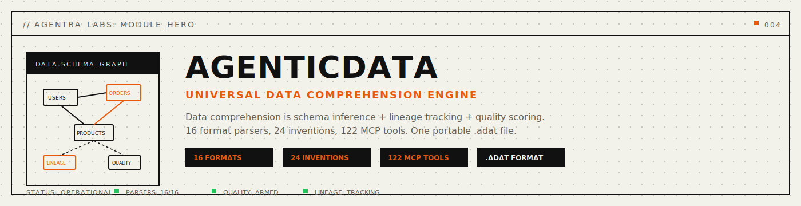

<p align="center">
  
</p>

<p align="center">
  
  
  
  
</p>

<p align="center">
  <a href="#install"></a>
  <a href="#mcp-server"></a>
  <a href="LICENSE"></a>
  <a href="docs/public/file-format.md"></a>
</p>

<p align="center">
  <strong>Universal data comprehension engine for AI agents.</strong>
</p>

<p align="center">
  <em>Every format parsed. Every schema inferred. Every lineage tracked. Every anomaly caught.</em>
</p>

<p align="center">
  <a href="#problems-solved">Problems Solved</a> · <a href="#quickstart">Quickstart</a> · <a href="#how-it-works">How It Works</a> · <a href="#mcp-server">MCP Tools</a> · <a href="#24-inventions">24 Inventions</a> · <a href="#install">Install</a> · <a href="docs/public/api-reference.md">API</a> · <a href="docs/public/SCENARIOS-AGENTIC-DATA.md">Scenarios</a>
</p>

---

## Every data tool solves one format.

pandas reads CSV but doesn't understand what the columns *mean*. SQL tools query databases but can't infer missing schemas. PDF parsers extract text but lose table structure. ETL tools transform data but don't track where it came from.

**AgenticData** is one engine that does ALL of it with understanding. Not just parsing — *comprehension*. Schema inference, quality scoring, lineage tracking, anomaly detection, PII redaction, and format conversion across 16 formats and 24 inventions.

<a name="problems-solved"></a>

## Problems Solved (Read This First)

- **Problem:** every tool handles one format, and you need a different tool for CSV vs JSON vs SQL vs PDF.
  **Solved:** 16 format parsers with auto-detection. Give it ANY file, it identifies and parses it.
- **Problem:** "what does column flag7 mean?" — nobody knows, the original developer left.
  **Solved:** Data Soul Extraction analyzes data itself to infer meaning, relationships, and business rules.
- **Problem:** ETL transforms data but you can't trace where a value came from.
  **Solved:** every record carries full lineage (Data DNA) — source, transforms, trust score.
- **Problem:** bad data silently corrupts downstream reports and ML models.
  **Solved:** Data Immune System scores quality 0-100, detects anomalies, quarantines bad records.
- **Problem:** GDPR requires redacting PII but regex misses context-dependent cases.
  **Solved:** context-aware PII detection (email, phone, SSN, credit card, IP) with configurable redaction policies.
- **Problem:** querying across 3 databases requires building a data warehouse.
  **Solved:** federated query across any registered source. Data stays in place.

<a name="quickstart"></a>

## Quickstart

```bash
# Detect format of any file
adat detect mydata.csv

# Ingest and analyze data — schema inferred, quality scored, lineage tracked
adat ingest mydata.csv

# Check data quality (0-100 score)
adat quality mydata

# Detect PII in sensitive data
adat pii sensitive.csv

# View inferred schema with type detection
adat schema mydata

# List all 16 supported formats
adat formats
```

<a name="how-it-works"></a>

## How It Works

```
         ┌─────────────────────────────────────┐
         │  ANY DATA SOURCE                     │
         │  CSV, JSON, XML, SQL, PDF, Email...  │
         └────────────────┬────────────────────┘
                          │
                 ┌────────▼────────┐
                 │  FORMAT DETECT   │  Auto-detection (16 formats)
                 └────────┬────────┘
                          │
                 ┌────────▼────────┐
                 │  PARSE + INFER  │  Schema inference + type detection
                 └────────┬────────┘
                          │
              ┌───────────┼───────────┐
              │           │           │
     ┌────────▼───┐  ┌────▼────┐  ┌──▼──────────┐
     │  QUALITY   │  │ LINEAGE │  │  TRANSFORM   │
     │  Score 0-100│ │  DNA    │  │  Lossless    │
     └────────────┘  └─────────┘  └──────────────┘
              │           │           │
              └───────────┼───────────┘
                          │
                 ┌────────▼────────┐
                 │  .adat FILE     │  Binary, compressed, portable
                 └─────────────────┘
```

<a name="install"></a>

## Install

```bash
# Default (desktop profile)
curl -fsSL https://agentralabs.tech/install/agentic-data | bash

# Desktop profile (explicit)
curl -fsSL https://agentralabs.tech/install/agentic-data/desktop | bash

# Terminal profile
curl -fsSL https://agentralabs.tech/install/agentic-data/terminal | bash

# Server profile
curl -fsSL https://agentralabs.tech/install/agentic-data/server | bash
```

**Standalone guarantee:** AgenticData works completely independently. No other Agentra components required.

<a name="mcp-server"></a>

## MCP Server

AgenticData exposes 122 tools across 24 inventions via MCP:

```json
{
  "mcpServers": {
    "agentic-data": {
      "command": "agentic-data-mcp",
      "args": []
    }
  }
}
```

Works with any MCP client: Claude Desktop, Codex, Cursor, VS Code, Windsurf, Cline, or any MCP-compatible tool.

<a name="24-inventions"></a>

## 24 Inventions

| # | Invention | Tools | Category |
|---|-----------|-------|----------|
| 1 | Schema Telepathy | 5 | Comprehension |
| 2 | Format Omniscience | 5 | Comprehension |
| 3 | Deep Document Comprehension | 6 | Comprehension |
| 4 | Data Soul Extraction | 5 | Comprehension |
| 5 | Lossless Transformation | 6 | Transformation |
| 6 | Cross-Format Bridge | 5 | Transformation |
| 7 | Media Alchemy | 5 | Transformation |
| 8 | Data Immune System | 6 | Quality |
| 9 | Temporal Archaeology | 5 | Quality |
| 10 | Data DNA | 5 | Quality |
| 11 | Predictive Schema Evolution | 5 | Intelligence |
| 12 | Cross-Dataset Reasoning | 5 | Intelligence |
| 13 | Query Prophecy | 5 | Intelligence |
| 14 | Anomaly Constellation | 5 | Intelligence |
| 15 | Geospatial Consciousness | 6 | Spatial |
| 16 | Data Vault | 5 | Security |
| 17 | Redaction Intelligence | 5 | Security |
| 18 | Data Federation | 5 | Collaboration |
| 19 | Data Versioning | 6 | Collaboration |
| 20 | Predictive Quality | 4 | Prophetic |
| 21 | Data Dream State | 4 | Prophetic |
| 22 | Synthetic Data Genesis | 4 | Prophetic |
| 23 | Data Metabolism | 5 | Prophetic |
| 24 | Collective Intelligence | 5 | Prophetic |

## Supported Formats

CSV, TSV, JSON, JSON Lines, XML, YAML, TOML, HTML, SQL, Log, Email (.eml), Calendar (.ics), GeoJSON, KML, GPX, Markdown

## .adat File Format

Binary, LZ4-compressed, BLAKE3-checksummed, memory-mappable. Same design principles as AgenticMemory's `.amem` — one file, self-contained, portable across platforms.

See [file-format.md](docs/public/file-format.md) for the complete specification.

## Operational Commands

```bash
# Full quality health report
adat quality <node>

# Schema exploration
adat schema <name>

# Format detection with confidence
adat detect <file>

# PII scanning
adat pii <file>

# Store status
adat status
```

## License

MIT — see [LICENSE](LICENSE)
